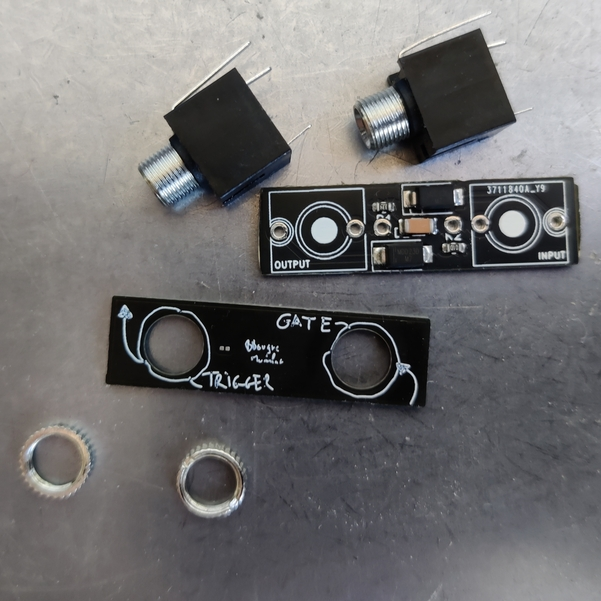
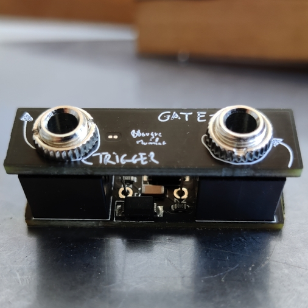

# Katsar | קצר

This project is the hebrew for "short" as I felt it was the right name for a gate to trigger converter.

This repository contains all the files necessary to build this little synth utility.
&nbsp;

&nbsp;

&nbsp;

All the separate components :

   

After soldering and assembly here is the final product :

  

